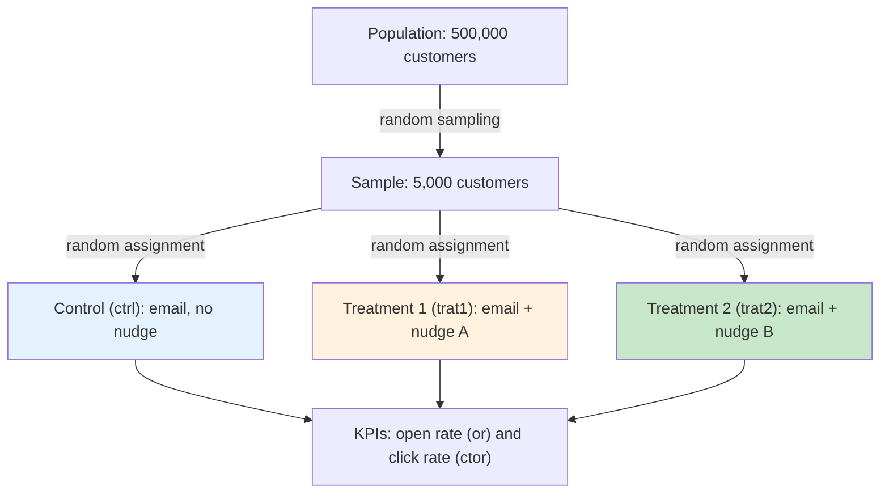

# Experiment design report

Markdown transcription (translated to English) of the original design-of-experiment brief.

## Project information

Internal project data name: Technical Test.

## Research background

The client, a bank, aims to increase the open rate of a commercial email and the number of clicks on a button that redirects customers to a sales web page. To this end, two email types were designed based on **Behavioral Science** principles. Their effectiveness is evaluated against a control email that includes no behavioral levers (nudges). The client would also like to evaluate the effect of a set of covariates available in the database.

## Hypothesis

The research hypothesis is that emails based on the Behavioral Science approach increase the email open rate and the button's CTOR (click-to-open rate) to the web page compared to the control email.

## Behavioral levers (nudges)

Two distinct behavioral levers (nudges) are proposed, one for each treatment email.

## Target dependent variables (KPIs)

Two dependent variables:

- The customer opens the email — dichotomous variable (0, 1) → `or`.
- The customer clicks the actionable button in the email — dichotomous variable (0, 1) → `ctor`.

## Behavioral independent variable

Organized into two treatments and one control:

- **Treatment 1** (`trat1`): email type 1 with behavioral lever 1.
- **Treatment 2** (`trat2`): email type 2 with behavioral lever 2.
- **Control** (`ctrl`): email type 3 with no behavioral lever.

## Independent covariates

Age, sex, investment, customer's app usage, card ownership, card type held, and customer's education. See [`VARIABLES.md`](VARIABLES.md) for the exact dataset columns.

## Data collection

Data obtained via **random sampling**.

## Sample size and allocation

A sample of 5,000 individuals was drawn from a total population of 500,000 customers, randomly assigned across the behavioral-lever groups (control, treatment 1, treatment 2).

## Experimental design (diagram)

Randomized controlled trial (RCT): a random sample is drawn from the customer base and randomly assigned to the control and the two treatment arms; the two KPIs (open, click) are then measured for every arm.

For the downstream funnel (open → click), see the causal funnel diagram in [`GUIA_CONCEPTUAL_TECNICA.md`](GUIA_CONCEPTUAL_TECNICA.md#5-causal-funnel-diagram).
