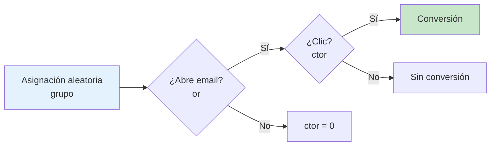

# Guía conceptual y técnica — Experimento de emails con nudges

Documento de referencia para el proyecto `causal-email-nudge-experiment`. Resume el problema de negocio, el marco causal, la implementación en código y cómo interpretar cada resultado numérico.

---

## 1. El problema de negocio

Un banco quiere **aumentar la interacción** con emails transaccionales o de marketing. En lugar de probar solo copy o diseño visual, el experimento evalúa **nudges de ciencias del comportamiento** incrustados en el email.

### Preguntas que responde el proyecto

| Nivel | Pregunta | Método |
|-------|----------|--------|
| Descriptivo | ¿Cómo se distribuyen los clientes y outcomes? | EDA (`01_load_and_eda.ipynb`) |
| Inferencial global | ¿Los nudges funcionan en promedio? | ATE, tests, regresión (`02_basic_experiment_analysis.ipynb`) |
| Inferencial local | ¿Para **quién** funciona mejor cada nudge? | CATE con meta-learners (`03_causal_ml_heterogeneity.ipynb`) |
| Decisión | ¿Qué desplegar y a qué escala? | Storytelling + impacto (`04_data_storytelling.ipynb`) |

### Diseño experimental (RCT)

- **Población objetivo:** 500.000 clientes del banco.
- **Muestra analizada:** 5.000 clientes (1% aprox.), asignados aleatoriamente.
- **Brazos:**
  - `ctrl` — email control (sin nudge).
  - `trat1` — nudge de comportamiento 1.
  - `trat2` — nudge de comportamiento 2.

La aleatorización es la pieza clave: en un RCT bien ejecutado, **no necesitamos controlar covariables para estimar el efecto causal promedio (ATE)**. Las covariables entran en juego para (a) verificar balance, (b) ganar precisión en regresión y (c) estimar efectos heterogéneos (CATE).

### ¿Qué es `ctrl` y qué es `trat`? (conceptual)

Los nombres en la columna `grupo` son **brazos del experimento**, no etiquetas arbitrarias:

| Código | Nombre usual | Qué es en la práctica |
|--------|--------------|------------------------|
| `ctrl` | **Control** | Email **sin** nudge de ciencias del comportamiento. Es la **referencia causal**: “¿qué pasa con el email estándar?” |
| `trat1` | **Tratamiento 1** | Mismo email base + **nudge A** (ej. anclaje, urgencia, framing distinto). |
| `trat2` | **Tratamiento 2** | Mismo email base + **nudge B** (otra intervención conductual). |

**`ctrl` no significa “no recibir email”.** Todos los clientes reciben un email; el control recibe la versión **sin** el nudge experimental. La pregunta causal es: *¿el nudge mejora la interacción respecto al email que ya enviábamos?*

**`trat` (trat1 / trat2)** son **intervenciones** que queremos evaluar. Cada uno define un resultado potencial distinto:

\[
Y_i(\text{ctrl}),\quad Y_i(\text{trat1}),\quad Y_i(\text{trat2})
\]

Para el cliente \(i\) solo observamos **uno** — el del brazo asignado aleatoriamente:

\[
Y_i^{\text{obs}} = Y_i(T_i), \quad T_i \in \{\text{ctrl}, \text{trat1}, \text{trat2}\}
\]

Los otros dos son **contrafactuales** (no observados). La aleatorización permite sustituir expectativas contrafactuales por medias del grupo correspondiente:

\[
ATE_{\text{trat2 vs ctrl}} = \mathbb{E}[Y(\text{trat2}) - Y(\text{ctrl})] \approx \bar{Y}_{\text{trat2}} - \bar{Y}_{\text{ctrl}}
\]

**Analogía:** en un ensayo clínico, “placebo” no es “sin medicina”; es el tratamiento de referencia. Aquí `ctrl` es el email de referencia; `trat1` y `trat2` son las variantes con nudge.

Para profundidad en CATE, meta-learners y DML, ver [`CAUSAL_ML.md`](CAUSAL_ML.md).

---

## 2. Variables y su significado causal

| Variable | Tipo | Rol causal | Interpretación |
|----------|------|------------|----------------|
| `iid` | ID | — | Identificador único del cliente |
| `grupo` | Tratamiento \(T\) | **Intervención** | Variante de email recibida |
| `or` | Binaria | **Outcome intermedio** | ¿Abrió el email? (open rate) |
| `ctor` | Binaria | **Outcome final** | ¿Hizo clic en el botón? |
| `sexo`, `edad`, `inve`, `uso_app`, `tarjeta_debito`, `tipo_tarjeta`, `formacion` | Covariables \(X\) | **Pre-tratamiento** | Perfil del cliente antes del email |

### Relación entre `or` y `ctor`

En los datos, **`ctor` está anidado en `or`**: si `or = 0`, entonces `ctor = 0` siempre. Por tanto:

\[
\text{ctor} = \mathbb{1}[\text{abrió}] \times \mathbb{1}[\text{clicó}]
\]

- **Open rate:** \(\bar{or} = P(\text{abrir})\)
- **Click rate (`ctor`):** \(P(\text{abrir} \cap \text{clicar})\) — tasa global de conversión a clic.
- **Click-to-open (CTOR condicional):** \(P(\text{clic} \mid \text{abrir}) = \bar{ctor} / \bar{or}\) cuando \(or > 0\).

El nudge puede actuar en **dos etapas del funnel**:

1. **Apertura** — el subject line / preview convence de abrir.
2. **Conversión post-apertura** — el contenido del email convence de clicar.

Por eso analizamos **ambos outcomes** por separado.

---

## 3. Marco causal: notación y estimandos

### Modelo potencial de resultados (Rubin)

Para cada cliente \(i\) existen resultados potenciales \(Y_i(0), Y_i(1), Y_i(2)\) según el brazo asignado. Solo observamos uno:

\[
Y_i^{\text{obs}} = Y_i(T_i), \quad T_i \in \{\text{ctrl}, \text{trat1}, \text{trat2}\}
\]

### ATE (Average Treatment Effect)

Para comparar `trat2` vs `ctrl` en click rate:

\[
ATE = \mathbb{E}[Y(\text{trat2}) - Y(\text{ctrl})]
\]

En un RCT con outcome binario, el estimador natural es la **diferencia de proporciones**:

\[
\widehat{ATE} = \bar{Y}_{\text{trat2}} - \bar{Y}_{\text{ctrl}}
\]

**Resultados en este dataset:**

| Comparación | Outcome | ATE (pp) | p-value | IC 95% |
|-------------|---------|----------|---------|--------|
| trat1 vs ctrl | or | +31.9 pp | ≈ 0 | [28.7, 35.1] |
| trat2 vs ctrl | or | +32.0 pp | ≈ 0 | [28.8, 35.1] |
| trat2 vs trat1 | or | +0.0 pp | 1.00 | [-3.3, +3.4] |
| trat1 vs ctrl | ctor | +26.5 pp | ≈ 0 | [23.9, 29.2] |
| trat2 vs ctrl | ctor | +40.2 pp | ≈ 0 | [37.4, 42.9] |
| trat2 vs trat1 | ctor | +13.6 pp | ≈ 0 | [10.3, 17.0] |

**Lectura:**

- Ambos nudges **duplican aproximadamente** la tasa de apertura (~29% → ~61%).
- En apertura, **trat1 ≈ trat2** (no hay diferencia estadísticamente significativa).
- En clics, **trat2 domina**: +40 pp vs control, y +14 pp vs trat1.
- El nudge 2 mejora sobre el 1 principalmente en la **conversión a clic**, no en apertura.

### CATE (Conditional Average Treatment Effect)

\[
CATE(x) = \mathbb{E}[Y(1) - Y(0) \mid X = x]
\]

Responde: *¿cuánto beneficio extra obtiene un cliente con perfil \(x\) si recibe el tratamiento?*

Esto habilita **personalización**: enviar `trat2` primero a segmentos con CATE alto.

---

## 4. Pipeline de análisis por fase

```
datos_prueba_tecnica.csv
        │
        ▼
  src/data.py ─── load_data(), tipos, GROUP_LABELS
        │
        ├──────────────────────────────────────────┐
        ▼                                          ▼
  01 EDA                                    02 ATE clásico
  • balance de grupos                       • diff proporciones + IC
  • tasas or/ctor                           • chi-cuadrado
  • balance covariables                     • regresión logística ajustada
        │                                          │
        └──────────────────┬───────────────────────┘
                           ▼
                    03 Causal ML (CATE)
                    • T-Learner / X-Learner
                    • segmentación por edad, uso_app
                           │
                           ▼
                    04 Storytelling
                    • narrativa ejecutiva
                    • impacto a 500k clientes
                    • recomendaciones
```

### Fase 1–2: Infraestructura (`src/data.py`)

```python
from src.data import load_data, GROUP_LABELS
df = load_data()
```

- Tipifica `grupo` como categórica ordenada (`ctrl < trat1 < trat2`).
- Convierte binarias a `int`.
- Centraliza la ruta del CSV en `DATA_PATH`.

### Fase 3: EDA (`01_load_and_eda.ipynb`)

**Objetivo:** Validar calidad de datos y plausibilidad del diseño.

Checks implementados:

1. 5.000 filas, 5.000 `iid` únicos, sin nulos.
2. Balance de tamaños por grupo (~1.650–1.700 por brazo).
3. Tests de balance en covariables (ANOVA / chi-cuadrado).

**Tasas observadas por grupo:**

| Grupo | Open rate | Click rate |
|-------|-----------|------------|
| ctrl  | 28.8%     | 8.7%       |
| trat1 | 60.8%     | 35.3%      |
| trat2 | 60.8%     | 48.9%      |

**Nota sobre balance:** Algunas covariables (`edad`, `inve`, `sexo`) muestran p-values bajos en tests univariados. Esto es **esperable con 5.000 observaciones** — tests de balance detectan diferencias mínimas. Lo relevante es que las magnitudes sean pequeñas y que el ATE no dependa de ajustes (se verifica en fase 4).

### Fase 4: Análisis clásico (`02_basic_experiment_analysis.ipynb` + `src/analysis.py`)

#### Estimador de diff-in-means

Para proporciones binarias, el error estándar es:

\[
SE = \sqrt{\frac{p_T(1-p_T)}{n_T} + \frac{p_C(1-p_C)}{n_C}}
\]

IC 95%: \(\widehat{ATE} \pm 1.96 \cdot SE\)

Implementación reutilizable:

```python
from src.analysis import all_ate_comparisons, scale_impact

ate_df = all_ate_comparisons(df)
impact = scale_impact(ate_pp=0.4015, population_size=500_000, outcome_label="clics")
# → ~200.773 clics adicionales vs control con trat2
```

#### Regresión logística ajustada

Modelo:

\[
\log\frac{P(Y=1)}{1-P(Y=1)} = \beta_0 + \beta_1 \cdot \mathbb{1}[trat1] + \beta_2 \cdot \mathbb{1}[trat2] + \gamma^T X
\]

| Outcome | Tratamiento | OR | Interpretación |
|---------|-------------|-----|----------------|
| or | trat1 | 2.62 | 2.6× odds de abrir vs control |
| or | trat2 | 1.66* | Ver nota abajo |
| ctor | trat1 | 2.49 | 2.5× odds de clic vs control |
| ctor | trat2 | 2.00 | 2× odds de clic vs control |

\*Los OR de `trat2` en open rate son menores que `trat1` **ajustando por covariables**, mientras que el ATE crudo es casi idéntico. Esto indica **confusión residual en covariables** (ligero desbalance) — otro motivo para confiar en el estimador no paramétrico del RCT como fuente principal.

### Fase 5: Causal ML (`03_causal_ml_heterogeneity.ipynb` + `src/causal.py`)

#### ¿Por qué meta-learners?

En un RCT, el ATE se estima fácilmente. Pero el negocio quiere **segmentos accionables**. Los meta-learners descomponen el problema en modelos de outcome supervisados:

| Learner | Idea | Fórmula del efecto |
|---------|------|-------------------|
| **S-Learner** | Un modelo con \(T\) como feature | \(\hat\tau(x) = \hat\mu(x,1) - \hat\mu(x,0)\) |
| **T-Learner** | Modelo separado por brazo | \(\hat\tau(x) = \hat\mu_1(x) - \hat\mu_0(x)\) |
| **X-Learner** | Usa propensity + imputación cruzada | Mejor cuando un brazo es más pequeño o hay heterogeneidad fuerte |
| **LinearDML** | Cross-fitting + regresión ortogonal | Robusto a nuisance mal estimados; ver `CAUSAL_ML.md` |

Implementación:

```python
from src.causal import prep_binary_comparison, fit_cate, validate_cate_vs_ate

X, T, Y = prep_binary_comparison(df, treatment_arm="trat2", outcome="ctor")
est = fit_cate(X, T, Y, label="trat2 vs ctrl (ctor)")
validation = validate_cate_vs_ate(df, "trat2", "ctor", est)
```

#### Resultados CATE (X-Learner, outcome `ctor`)

| Comparación | ATE manual | Media CATE | Std CATE |
|-------------|------------|------------|----------|
| trat1 vs ctrl | 0.265 | 0.171 | 0.41 |
| trat2 vs ctrl | 0.402 | 0.204 | 0.46 |

#### Heterogeneidad detectada (trat2 vs ctrl)

| Segmento | Media CATE | Interpretación |
|----------|------------|----------------|
| Edad 18–35 | **0.67** | Jóvenes: respuesta muy alta al nudge 2 |
| Edad 36–50 | 0.21 | Respuesta moderada |
| Edad 51+ | **−0.01** | Sin beneficio neto (posible fatiga o mismatch) |
| Sin app | 0.17 | |
| Con app | **0.24** | Usuarios digitales responden más |

#### ⚠️ Validación importante: calibración del CATE

La **media del CATE debería aproximar el ATE** (ambos estiman el mismo estimando bajo identificación causal). En este proyecto hay una **brecha sistemática** (~10–20 pp):

- ATE manual trat2: **0.40**
- Media CATE X-Learner: **0.20**

**Causas probables:**

1. **Outcome binario + Random Forest:** los meta-learners usan modelos de regresión/clasificación que pueden estar mal calibrados en las colas.
2. **Alta varianza individual:** std(CATE) ≈ 0.46; muchos CATE negativos compensan los positivos extremos.
3. **Propensity mal convergida:** en RCT la propensión es ~0.5, pero el modelo logístico puede no converger bien con muchas dummies (warning en notebook).

**Implicación práctica:**

- Usar CATE para **ranking relativo de segmentos** (quién responde más vs menos), no para magnitudes absolutas de impacto.
- Para magnitudes absolutas, confiar en el **ATE del notebook 02**.
- Opcional: `calibrate_cate_to_ate(cate, ate, method="shift")` alinea la media al ATE preservando el ranking.
- Estimadores adicionales: `LinearDML` y `CausalForestDML` (mismo orden de magnitud ~0.16–0.20).

#### Mediación del funnel (`src/mediation.py`)

Como `ctor` está anidado en `or`:

| Comparación | Vía apertura | Vía conversión | Insight |
|-------------|--------------|----------------|---------|
| trat1 vs ctrl | 36% | **64%** | También mejora CTO, no solo apertura |
| trat2 vs ctrl | 24% | **76%** | Conversión post-apertura es el motor |
| trat2 vs trat1 | ~0% | **~100%** | Misma apertura; trat2 gana solo en clic |

---

## 5. Diagrama del funnel causal



Los nudges mueven el funnel en **dos puntos**:

- **trat1 y trat2** → gran salto en `or` (apertura).
- **trat2 adicional** → salto extra en `ctor` dado que ya abrieron.

---

## 6. Decisiones de negocio (Fase 6 — storytelling)

### Recomendación principal

**Desplegar `trat2` como variante principal** para la base de 500.000 clientes.

### Impacto estimado

| Métrica | Control | Trat2 | Delta |
|---------|---------|-------|-------|
| Click rate | 8.7% | 48.9% | **+40.2 pp** |
| Clics en 500k | 43.650 | 244.400 | **+200.773** |

### Personalización sugerida

1. **Priorizar `trat2` en clientes 18–35 y usuarios de app** (CATE alto).
2. **Evaluar alternativa para 51+** — el CATE cercano a cero sugiere que el nudge 2 no aporta o puede ser contraproducente.
3. **Mantener A/B continuo** post-lanzamiento para detectar fatiga del nudge.

---

## 7. Mapa de archivos del repositorio

```
causal-email-nudge-experiment/
├── data/datos_prueba_tecnica.csv    # 5.000 filas del experimento
├── docs/
│   ├── DOE_prueba_tecnica.docx      # Diseño del experimento (BeWay)
│   ├── Dic_Variables_Prueba_Tecnica.pdf
│   ├── GUIA_CONCEPTUAL_TECNICA.md   # ← este documento
│   ├── CAUSAL_ML.md                 # Marco Causal ML (meta-learners, DML)
│   └── 04_DATA_STORYTELLING.md      # Narrativa ejecutiva (Markdown)
├── notebooks/
│   ├── 01_load_and_eda.ipynb
│   ├── 02_basic_experiment_analysis.ipynb
│   ├── 03_causal_ml_heterogeneity.ipynb
│   └── 04_data_storytelling.ipynb
├── src/
│   ├── data.py       # Carga y tipado
│   ├── analysis.py   # ATE, regresión, impacto
│   ├── causal.py     # CATE (meta-learners + DML + CausalForest)
│   └── mediation.py  # Descomposición funnel or → ctor
├── tests/test_core.py
├── scripts/build_notebooks.py
└── requirements.txt
```

---

## 8. Supuestos y limitaciones

| Supuesto | Estado en este proyecto | Riesgo |
|----------|------------------------|--------|
| SUTVA (no interferencia) | Emails a clientes distintos | Bajo |
| Asignación aleatoria | Verificado por diseño | Bajo |
| Unidades i.i.d. | Muestra aleatoria simple | Bajo |
| Medición correcta | Sin nulos, binarias consistentes | Bajo |
| External validity | Solo 5k de 500k | Medio — validar en rollout |
| CATE calibrado | Brecha ATE vs media CATE | Medio — ranking + `calibrate_cate_to_ate` |

---

## 9. Próximos pasos técnicos sugeridos

1. **Policy learning:** reglas de tratamiento óptimo (`PolicyTree`) por segmento.
2. **Calibración avanzada:** Platt / isotónica sobre `predict_proba` de los modelos base.
3. **Rollout secuencial:** validar external validity en una cohorte holdout de los 500k.
4. Mantener narrativa en Markdown — [`04_DATA_STORYTELLING.md`](04_DATA_STORYTELLING.md).

---

## 10. Referencias rápidas

- **ATE / diff-in-means:** estimador principal en RCT; ver `src/analysis.py`.
- **Regresión logística:** odds ratios ajustados; notebook 02.
- **S/T/X-Learner, LinearDML, CausalForestDML:** `src/causal.py`, [`CAUSAL_ML.md`](CAUSAL_ML.md).
- **Mediación funnel:** `src/mediation.py`.
- **Tests:** `pytest tests/`.
- **Marco potencial de resultados:** Imbens & Rubin (2015), *Causal Inference for Statistics, Social, and Biomedical Sciences*.
