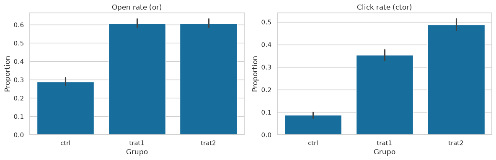
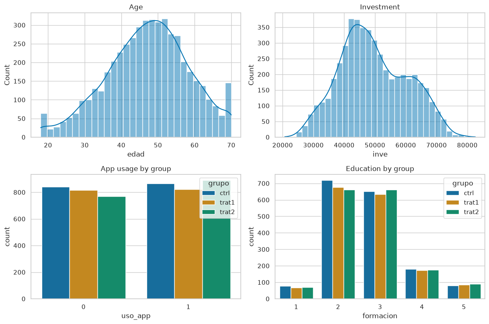

# 01 — Data loading & EDA

Exploration of the A/B email experiment with behavioral-science nudges.


```python
import sys
from pathlib import Path

import matplotlib.pyplot as plt
import numpy as np
import pandas as pd
import seaborn as sns
from scipy import stats

ROOT = Path.cwd().parent if Path.cwd().name == 'notebooks' else Path.cwd()
sys.path.insert(0, str(ROOT))

from src.data import GROUP_LABELS, load_data

sns.set_theme(style='whitegrid', palette='colorblind')
plt.rcParams['figure.figsize'] = (10, 5)
```

## Loading and validation


```python
df = load_data(ROOT / 'data' / 'datos_prueba_tecnica.csv')
print(f'Rows: {len(df):,} | Columns: {df.shape[1]}')
print(f'Null values: {df.isna().sum().sum()}')
df.head()
```

    Rows: 5,000 | Columns: 11
    Null values: 0


<div>
<style scoped>
    .dataframe tbody tr th:only-of-type {
        vertical-align: middle;
    }

    .dataframe tbody tr th {
        vertical-align: top;
    }

    .dataframe thead th {
        text-align: right;
    }
</style>
<table border="1" class="dataframe">
  <thead>
    <tr style="text-align: right;">
      <th></th>
      <th>iid</th>
      <th>grupo</th>
      <th>or</th>
      <th>ctor</th>
      <th>sexo</th>
      <th>edad</th>
      <th>inve</th>
      <th>uso_app</th>
      <th>tarjeta_debito</th>
      <th>tipo_tarjeta</th>
      <th>formacion</th>
    </tr>
  </thead>
  <tbody>
    <tr>
      <th>0</th>
      <td>1</td>
      <td>ctrl</td>
      <td>0</td>
      <td>0</td>
      <td>0</td>
      <td>38.296148</td>
      <td>51019.88612</td>
      <td>1</td>
      <td>0</td>
      <td>3</td>
      <td>2</td>
    </tr>
    <tr>
      <th>1</th>
      <td>2</td>
      <td>trat1</td>
      <td>1</td>
      <td>1</td>
      <td>1</td>
      <td>54.470670</td>
      <td>63337.21881</td>
      <td>1</td>
      <td>0</td>
      <td>3</td>
      <td>4</td>
    </tr>
    <tr>
      <th>2</th>
      <td>3</td>
      <td>trat2</td>
      <td>1</td>
      <td>1</td>
      <td>1</td>
      <td>35.713804</td>
      <td>59901.62123</td>
      <td>1</td>
      <td>0</td>
      <td>3</td>
      <td>3</td>
    </tr>
    <tr>
      <th>3</th>
      <td>4</td>
      <td>trat1</td>
      <td>0</td>
      <td>0</td>
      <td>1</td>
      <td>49.614319</td>
      <td>50422.66906</td>
      <td>0</td>
      <td>0</td>
      <td>3</td>
      <td>3</td>
    </tr>
    <tr>
      <th>4</th>
      <td>5</td>
      <td>trat1</td>
      <td>0</td>
      <td>0</td>
      <td>1</td>
      <td>41.816158</td>
      <td>45562.30864</td>
      <td>0</td>
      <td>1</td>
      <td>3</td>
      <td>3</td>
    </tr>
  </tbody>
</table>
</div>


```python
assert len(df) == 5000
assert df['iid'].nunique() == 5000
assert set(df['grupo'].cat.categories) == {'ctrl', 'trat1', 'trat2'}
print('Basic validation OK')
```

    Basic validation OK


## Randomization balance by group


```python
group_counts = df['grupo'].value_counts().sort_index()
group_share = (group_counts / len(df) * 100).round(1)
balance = pd.DataFrame({'N': group_counts, '%': group_share})
balance.index = balance.index.map(GROUP_LABELS)
balance
```


<div>
<style scoped>
    .dataframe tbody tr th:only-of-type {
        vertical-align: middle;
    }

    .dataframe tbody tr th {
        vertical-align: top;
    }

    .dataframe thead th {
        text-align: right;
    }
</style>
<table border="1" class="dataframe">
  <thead>
    <tr style="text-align: right;">
      <th></th>
      <th>N</th>
      <th>%</th>
    </tr>
    <tr>
      <th>grupo</th>
      <th></th>
      <th></th>
    </tr>
  </thead>
  <tbody>
    <tr>
      <th>Control (no nudge)</th>
      <td>1707</td>
      <td>34.1</td>
    </tr>
    <tr>
      <th>Treatment 1 (nudge 1)</th>
      <td>1636</td>
      <td>32.7</td>
    </tr>
    <tr>
      <th>Treatment 2 (nudge 2)</th>
      <td>1657</td>
      <td>33.1</td>
    </tr>
  </tbody>
</table>
</div>


## Outcome rates by group


```python
rates = (
    df.groupby('grupo', observed=True)[['or', 'ctor']]
    .mean()
    .rename(columns={'or': 'open_rate', 'ctor': 'click_rate'})
)
rates['ctor_given_open'] = (
    df[df['or'] == 1].groupby('grupo', observed=True)['ctor'].mean()
)
rates.index = rates.index.map(GROUP_LABELS)
rates.round(3)
```


<div>
<style scoped>
    .dataframe tbody tr th:only-of-type {
        vertical-align: middle;
    }

    .dataframe tbody tr th {
        vertical-align: top;
    }

    .dataframe thead th {
        text-align: right;
    }
</style>
<table border="1" class="dataframe">
  <thead>
    <tr style="text-align: right;">
      <th></th>
      <th>open_rate</th>
      <th>click_rate</th>
      <th>ctor_given_open</th>
    </tr>
    <tr>
      <th>grupo</th>
      <th></th>
      <th></th>
      <th></th>
    </tr>
  </thead>
  <tbody>
    <tr>
      <th>Control (no nudge)</th>
      <td>0.288</td>
      <td>0.087</td>
      <td>0.303</td>
    </tr>
    <tr>
      <th>Treatment 1 (nudge 1)</th>
      <td>0.608</td>
      <td>0.353</td>
      <td>0.580</td>
    </tr>
    <tr>
      <th>Treatment 2 (nudge 2)</th>
      <td>0.608</td>
      <td>0.489</td>
      <td>0.804</td>
    </tr>
  </tbody>
</table>
</div>


```python
fig, axes = plt.subplots(1, 2, figsize=(12, 4))
for ax, metric, title in zip(
    axes,
    ['or', 'ctor'],
    ['Open rate (or)', 'Click rate (ctor)'],
):
    sns.barplot(data=df, x='grupo', y=metric, errorbar=('ci', 95), ax=ax)
    ax.set_title(title)
    ax.set_xlabel('Grupo')
    ax.set_ylabel('Proportion')
plt.tight_layout()
plt.show()
```


    

    


## Covariate distributions


```python
fig, axes = plt.subplots(2, 2, figsize=(12, 8))
sns.histplot(df['edad'], kde=True, ax=axes[0, 0])
axes[0, 0].set_title('Age')
sns.histplot(df['inve'], kde=True, ax=axes[0, 1])
axes[0, 1].set_title('Investment')
sns.countplot(data=df, x='uso_app', hue='grupo', ax=axes[1, 0])
axes[1, 0].set_title('App usage by group')
sns.countplot(data=df, x='formacion', hue='grupo', ax=axes[1, 1])
axes[1, 1].set_title('Education by group')
plt.tight_layout()
plt.show()
```


    

    


## Are the covariates balanced across groups?


```python
covariates = ['edad', 'inve', 'sexo', 'uso_app', 'tarjeta_debito']
balance_tests = []
for col in covariates:
    groups = [g[col].values for _, g in df.groupby('grupo', observed=True)]
    if col in ['edad', 'inve']:
        stat, p = stats.f_oneway(*groups)
        test = 'ANOVA'
    else:
        table = pd.crosstab(df['grupo'], df[col])
        stat, p, _, _ = stats.chi2_contingency(table)
        test = 'Chi-cuadrado'
    balance_tests.append({'variable': col, 'test': test, 'p_value': p})
balance_df = pd.DataFrame(balance_tests).round(4)
balance_df
```


<div>
<style scoped>
    .dataframe tbody tr th:only-of-type {
        vertical-align: middle;
    }

    .dataframe tbody tr th {
        vertical-align: top;
    }

    .dataframe thead th {
        text-align: right;
    }
</style>
<table border="1" class="dataframe">
  <thead>
    <tr style="text-align: right;">
      <th></th>
      <th>variable</th>
      <th>test</th>
      <th>p_value</th>
    </tr>
  </thead>
  <tbody>
    <tr>
      <th>0</th>
      <td>edad</td>
      <td>ANOVA</td>
      <td>0.000</td>
    </tr>
    <tr>
      <th>1</th>
      <td>inve</td>
      <td>ANOVA</td>
      <td>0.000</td>
    </tr>
    <tr>
      <th>2</th>
      <td>sexo</td>
      <td>Chi-cuadrado</td>
      <td>0.000</td>
    </tr>
    <tr>
      <th>3</th>
      <td>uso_app</td>
      <td>Chi-cuadrado</td>
      <td>0.103</td>
    </tr>
    <tr>
      <th>4</th>
      <td>tarjeta_debito</td>
      <td>Chi-cuadrado</td>
      <td>0.576</td>
    </tr>
  </tbody>
</table>
</div>


**EDA takeaway:** The three arms are reasonably balanced. The treatments show a clear increase in open rate and click rate versus control; `trat2` appears to beat `trat1` on clicks.

---

← Previous: [Causal ML in the email experiment](../CAUSAL_ML.md)  ·  Next: [02 — Classic experiment analysis (ATE)](02_basic_experiment_analysis.md) →
