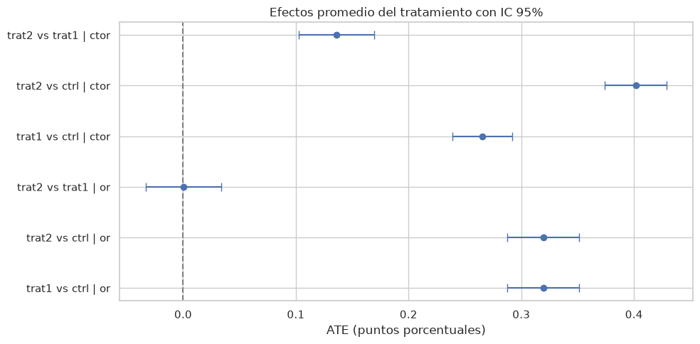

# 02 — Classic experiment analysis (ATE)


```python
import sys
from pathlib import Path

import matplotlib.pyplot as plt
import numpy as np
import pandas as pd
import seaborn as sns
import statsmodels.formula.api as smf
from scipy import stats
from statsmodels.stats.proportion import proportion_confint

ROOT = Path.cwd().parent if Path.cwd().name == 'notebooks' else Path.cwd()
sys.path.insert(0, str(ROOT))
from src.data import GROUP_LABELS, load_data

sns.set_theme(style='whitegrid')
df = load_data(ROOT / 'data' / 'datos_prueba_tecnica.csv')
```

## Helper functions


```python
def ate_proportion(df, treatment, control, outcome):
    p_t = df.loc[df['grupo'] == treatment, outcome].mean()
    p_c = df.loc[df['grupo'] == control, outcome].mean()
    diff = p_t - p_c
    n_t = (df['grupo'] == treatment).sum()
    n_c = (df['grupo'] == control).sum()
    se = np.sqrt(p_t * (1 - p_t) / n_t + p_c * (1 - p_c) / n_c)
    ci_low, ci_high = diff - 1.96 * se, diff + 1.96 * se
    table = pd.crosstab(df.loc[df['grupo'].isin([treatment, control]), 'grupo'],
                        df.loc[df['grupo'].isin([treatment, control]), outcome])
    chi2, p, _, _ = stats.chi2_contingency(table)
    return {
        'comparison': f'{treatment} vs {control}',
        'outcome': outcome,
        'rate_treatment': p_t,
        'rate_control': p_c,
        'ate_pp': diff,
        'lift_pct': (diff / p_c * 100) if p_c else np.nan,
        'ci_low': ci_low,
        'ci_high': ci_high,
        'p_value': p,
    }

comparisons = [('trat1', 'ctrl'), ('trat2', 'ctrl'), ('trat2', 'trat1')]
results = []
for outcome in ['or', 'ctor']:
    for t, c in comparisons:
        results.append(ate_proportion(df, t, c, outcome))
ate_df = pd.DataFrame(results).round(4)
ate_df
```


<div>
<style scoped>
    .dataframe tbody tr th:only-of-type {
        vertical-align: middle;
    }

    .dataframe tbody tr th {
        vertical-align: top;
    }

    .dataframe thead th {
        text-align: right;
    }
</style>
<table border="1" class="dataframe">
  <thead>
    <tr style="text-align: right;">
      <th></th>
      <th>comparison</th>
      <th>outcome</th>
      <th>rate_treatment</th>
      <th>rate_control</th>
      <th>ate_pp</th>
      <th>lift_pct</th>
      <th>ci_low</th>
      <th>ci_high</th>
      <th>p_value</th>
    </tr>
  </thead>
  <tbody>
    <tr>
      <th>0</th>
      <td>trat1 vs ctrl</td>
      <td>or</td>
      <td>0.6076</td>
      <td>0.2882</td>
      <td>0.3194</td>
      <td>110.8004</td>
      <td>0.2874</td>
      <td>0.3513</td>
      <td>0.0</td>
    </tr>
    <tr>
      <th>1</th>
      <td>trat2 vs ctrl</td>
      <td>or</td>
      <td>0.6077</td>
      <td>0.2882</td>
      <td>0.3195</td>
      <td>110.8509</td>
      <td>0.2877</td>
      <td>0.3513</td>
      <td>0.0</td>
    </tr>
    <tr>
      <th>2</th>
      <td>trat2 vs trat1</td>
      <td>or</td>
      <td>0.6077</td>
      <td>0.6076</td>
      <td>0.0001</td>
      <td>0.0239</td>
      <td>-0.0332</td>
      <td>0.0335</td>
      <td>1.0</td>
    </tr>
    <tr>
      <th>3</th>
      <td>trat1 vs ctrl</td>
      <td>ctor</td>
      <td>0.3527</td>
      <td>0.0873</td>
      <td>0.2654</td>
      <td>304.0543</td>
      <td>0.2387</td>
      <td>0.2921</td>
      <td>0.0</td>
    </tr>
    <tr>
      <th>4</th>
      <td>trat2 vs ctrl</td>
      <td>ctor</td>
      <td>0.4888</td>
      <td>0.0873</td>
      <td>0.4015</td>
      <td>460.0280</td>
      <td>0.3740</td>
      <td>0.4291</td>
      <td>0.0</td>
    </tr>
    <tr>
      <th>5</th>
      <td>trat2 vs trat1</td>
      <td>ctor</td>
      <td>0.4888</td>
      <td>0.3527</td>
      <td>0.1361</td>
      <td>38.6022</td>
      <td>0.1027</td>
      <td>0.1695</td>
      <td>0.0</td>
    </tr>
  </tbody>
</table>
</div>


## Effects forest plot


```python
plot_df = ate_df.copy()
plot_df['label'] = plot_df['comparison'] + ' | ' + plot_df['outcome']
fig, ax = plt.subplots(figsize=(10, 5))
y = np.arange(len(plot_df))
ax.errorbar(plot_df['ate_pp'], y,
            xerr=[plot_df['ate_pp'] - plot_df['ci_low'], plot_df['ci_high'] - plot_df['ate_pp']],
            fmt='o', capsize=4)
ax.axvline(0, color='gray', linestyle='--')
ax.set_yticks(y)
ax.set_yticklabels(plot_df['label'])
ax.set_xlabel('ATE (puntos porcentuales)')
ax.set_title('Efectos promedio del tratamiento con IC 95%')
plt.tight_layout()
plt.show()
```


    

    


## Logistic regression adjusted for covariates


```python
formula = (
    'Q("or") ~ C(grupo, Treatment(reference="ctrl")) + edad + sexo + inve + '
    'uso_app + tarjeta_debito + C(tipo_tarjeta) + C(formacion)'
)
model_or = smf.logit(formula, data=df).fit(disp=0)
print(model_or.summary2().tables[1].loc[
    [x for x in model_or.params.index if 'grupo' in x]
])
```

                                                       Coef.  Std.Err.          z  \
    C(grupo, Treatment(reference="ctrl"))[T.trat1]  0.961783  0.079214  12.141593   
    C(grupo, Treatment(reference="ctrl"))[T.trat2]  0.508610  0.084337   6.030682   
    
                                                           P>|z|    [0.025  \
    C(grupo, Treatment(reference="ctrl"))[T.trat1]  6.357604e-34  0.806527   
    C(grupo, Treatment(reference="ctrl"))[T.trat2]  1.632690e-09  0.343312   
    
                                                      0.975]  
    C(grupo, Treatment(reference="ctrl"))[T.trat1]  1.117040  
    C(grupo, Treatment(reference="ctrl"))[T.trat2]  0.673908  


```python
formula_ctor = formula.replace('Q("or") ~', 'ctor ~')
model_ctor = smf.logit(formula_ctor, data=df).fit(disp=0)
print(model_ctor.summary2().tables[1].loc[
    [x for x in model_ctor.params.index if 'grupo' in x]
])
```

                                                       Coef.  Std.Err.         z  \
    C(grupo, Treatment(reference="ctrl"))[T.trat1]  0.912276  0.114582  7.961744   
    C(grupo, Treatment(reference="ctrl"))[T.trat2]  0.692350  0.124464  5.562661   
    
                                                           P>|z|    [0.025  \
    C(grupo, Treatment(reference="ctrl"))[T.trat1]  1.696316e-15  0.687699   
    C(grupo, Treatment(reference="ctrl"))[T.trat2]  2.656925e-08  0.448405   
    
                                                      0.975]  
    C(grupo, Treatment(reference="ctrl"))[T.trat1]  1.136854  
    C(grupo, Treatment(reference="ctrl"))[T.trat2]  0.936295  


**Takeaway:** Both nudges significantly increase open rate and click rate. Trat2 beats trat1 on clicks. The effects persist after adjusting for covariates.

---

← Previous: [01 — Data loading & EDA](01_load_and_eda.md)  ·  Next: [03 — Causal ML: heterogeneous effects (CATE)](03_causal_ml_heterogeneity.md) →
