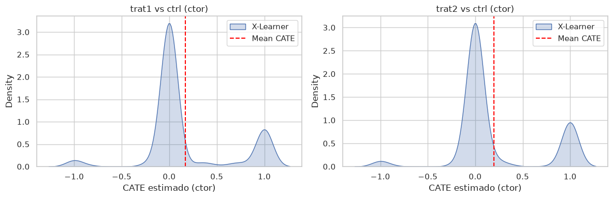

# 03 — Causal ML: heterogeneous effects (CATE)

## Conceptual framing

In notebook 02 we estimated the **ATE** (average treatment effect): does the nudge work *in general*?

Here we estimate the **CATE** (conditional average treatment effect): does the nudge work *for customers with profile X*?

$$
\tau(x) = \mathbb{E}[Y(1) - Y(0) \mid X = x]
$$

**Meta-learners** (S/T/X-Learner) and **LinearDML** estimate heterogeneous effects. In a randomized controlled trial (RCT) the propensity is ~0.5, which simplifies identification.

> **Full guide:** [`docs/GUIA_CONCEPTUAL_TECNICA.md`](../docs/GUIA_CONCEPTUAL_TECNICA.md) and [`docs/CAUSAL_ML.md`](../docs/CAUSAL_ML.md).


```python
import sys
from pathlib import Path

import matplotlib.pyplot as plt
import pandas as pd
import seaborn as sns

ROOT = Path.cwd().parent if Path.cwd().name == 'notebooks' else Path.cwd()
sys.path.insert(0, str(ROOT))
from src.causal import (
    calibrate_cate_to_ate,
    fit_cate,
    prep_binary_comparison,
    segment_cate_summary,
    validate_cate_vs_ate,
)
from src.data import load_data
from src.mediation import all_funnel_mediations

sns.set_theme(style='whitegrid')
df = load_data(ROOT / 'data' / 'datos_prueba_tecnica.csv')

```

## Preparation: binary treatment-vs-control comparisons


```python
X1, T1, Y1 = prep_binary_comparison(df, 'trat1')
X2, T2, Y2 = prep_binary_comparison(df, 'trat2')
print(f'Trat1 vs ctrl: {X1.shape[0]} obs, {X1.shape[1]} features')
print(f'Trat2 vs ctrl: {X2.shape[0]} obs, {X2.shape[1]} features')
```

    Trat1 vs ctrl: 3343 obs, 13 features
    Trat2 vs ctrl: 3364 obs, 13 features


## S/T/X-Learner and LinearDML (EconML)


```python
cate_trat1 = fit_cate(X1, T1, Y1, 'trat1 vs ctrl (ctor)')
cate_trat2 = fit_cate(X2, T2, Y2, 'trat2 vs ctrl (ctor)')

cols = ['cate_s', 'cate_t', 'cate_x', 'cate_dml', 'cate_cf']
cate_trat1.to_frame().groupby('label')[cols].mean().round(4)

```


<div>
<style scoped>
    .dataframe tbody tr th:only-of-type {
        vertical-align: middle;
    }

    .dataframe tbody tr th {
        vertical-align: top;
    }

    .dataframe thead th {
        text-align: right;
    }
</style>
<table border="1" class="dataframe">
  <thead>
    <tr style="text-align: right;">
      <th></th>
      <th>cate_s</th>
      <th>cate_t</th>
      <th>cate_x</th>
      <th>cate_dml</th>
      <th>cate_cf</th>
    </tr>
    <tr>
      <th>label</th>
      <th></th>
      <th></th>
      <th></th>
      <th></th>
      <th></th>
    </tr>
  </thead>
  <tbody>
    <tr>
      <th>trat1 vs ctrl (ctor)</th>
      <td>0.157</td>
      <td>0.1585</td>
      <td>0.1709</td>
      <td>0.153936</td>
      <td>0.1612</td>
    </tr>
  </tbody>
</table>
</div>


## CATE distribution


```python
cate_all = pd.concat([cate_trat1.to_frame(), cate_trat2.to_frame()], ignore_index=True)

fig, axes = plt.subplots(1, 2, figsize=(12, 4))
for ax, label in zip(axes, cate_all['label'].unique()):
    subset = cate_all[cate_all['label'] == label]
    sns.kdeplot(subset['cate_x'], fill=True, ax=ax, label='X-Learner')
    ax.axvline(subset['cate_x'].mean(), color='red', linestyle='--', label='Mean CATE')
    ax.set_title(label)
    ax.set_xlabel('CATE estimado (ctor)')
    ax.legend()
plt.tight_layout()
plt.show()
```


    

    


## Funnel mediation (`or` → `ctor`)

Since `ctor` is nested within `or`, we decompose the ATE into **via opening** vs **via post-open conversion**. Details in [`docs/CAUSAL_ML.md`](../docs/CAUSAL_ML.md) §8.


```python
med = all_funnel_mediations(df)
med[['comparison', 'ate_ctor', 'effect_via_open', 'effect_via_conversion',
     'share_via_open', 'share_via_conversion']].round(4)

```


<div>
<style scoped>
    .dataframe tbody tr th:only-of-type {
        vertical-align: middle;
    }

    .dataframe tbody tr th {
        vertical-align: top;
    }

    .dataframe thead th {
        text-align: right;
    }
</style>
<table border="1" class="dataframe">
  <thead>
    <tr style="text-align: right;">
      <th></th>
      <th>comparison</th>
      <th>ate_ctor</th>
      <th>effect_via_open</th>
      <th>effect_via_conversion</th>
      <th>share_via_open</th>
      <th>share_via_conversion</th>
    </tr>
  </thead>
  <tbody>
    <tr>
      <th>0</th>
      <td>trat1 vs ctrl</td>
      <td>0.2654</td>
      <td>0.0967</td>
      <td>0.1687</td>
      <td>0.3644</td>
      <td>0.6356</td>
    </tr>
    <tr>
      <th>1</th>
      <td>trat2 vs ctrl</td>
      <td>0.4015</td>
      <td>0.0968</td>
      <td>0.3048</td>
      <td>0.2410</td>
      <td>0.7590</td>
    </tr>
    <tr>
      <th>2</th>
      <td>trat2 vs trat1</td>
      <td>0.1361</td>
      <td>0.0001</td>
      <td>0.1361</td>
      <td>0.0006</td>
      <td>0.9994</td>
    </tr>
  </tbody>
</table>
</div>


## Heterogeneity by segment


```python
print('Trat1 — by age:')
display(segment_cate_summary(cate_trat1.to_frame(), 'edad', bins=[18, 35, 50, 100], labels=['18-35', '36-50', '51+']))
print('Trat2 — by app usage:')
display(segment_cate_summary(cate_trat2.to_frame(), 'uso_app'))
```

    Trat1 — by age:


<div>
<style scoped>
    .dataframe tbody tr th:only-of-type {
        vertical-align: middle;
    }

    .dataframe tbody tr th {
        vertical-align: top;
    }

    .dataframe thead th {
        text-align: right;
    }
</style>
<table border="1" class="dataframe">
  <thead>
    <tr style="text-align: right;">
      <th></th>
      <th>mean</th>
      <th>std</th>
      <th>count</th>
    </tr>
    <tr>
      <th>segment</th>
      <th></th>
      <th></th>
      <th></th>
    </tr>
  </thead>
  <tbody>
    <tr>
      <th>18-35</th>
      <td>0.172698</td>
      <td>0.391680</td>
      <td>228</td>
    </tr>
    <tr>
      <th>36-50</th>
      <td>0.189392</td>
      <td>0.455002</td>
      <td>1485</td>
    </tr>
    <tr>
      <th>51+</th>
      <td>0.154059</td>
      <td>0.456876</td>
      <td>1628</td>
    </tr>
  </tbody>
</table>
</div>


    Trat2 — by app usage:


<div>
<style scoped>
    .dataframe tbody tr th:only-of-type {
        vertical-align: middle;
    }

    .dataframe tbody tr th {
        vertical-align: top;
    }

    .dataframe thead th {
        text-align: right;
    }
</style>
<table border="1" class="dataframe">
  <thead>
    <tr style="text-align: right;">
      <th></th>
      <th>mean</th>
      <th>std</th>
      <th>count</th>
    </tr>
    <tr>
      <th>segment</th>
      <th></th>
      <th></th>
      <th></th>
    </tr>
  </thead>
  <tbody>
    <tr>
      <th>0</th>
      <td>0.162013</td>
      <td>0.426911</td>
      <td>1608</td>
    </tr>
    <tr>
      <th>1</th>
      <td>0.226120</td>
      <td>0.481857</td>
      <td>1756</td>
    </tr>
  </tbody>
</table>
</div>


**Validation:** The mean CATE should approximate the ATE from notebook 02. If there is a gap (common with RF on binary outcomes), use CATE for **segment ranking**, not for absolute magnitudes. Optional: `calibrate_cate_to_ate` aligns the mean to the ATE. See [`docs/CAUSAL_ML.md`](../docs/CAUSAL_ML.md).


```python
validate_cate_vs_ate(df, 'trat2', 'ctor', cate_trat2).round(4)
```


<div>
<style scoped>
    .dataframe tbody tr th:only-of-type {
        vertical-align: middle;
    }

    .dataframe tbody tr th {
        vertical-align: top;
    }

    .dataframe thead th {
        text-align: right;
    }
</style>
<table border="1" class="dataframe">
  <thead>
    <tr style="text-align: right;">
      <th></th>
      <th>metric</th>
      <th>value</th>
      <th>gap_vs_ate</th>
    </tr>
  </thead>
  <tbody>
    <tr>
      <th>0</th>
      <td>ATE (diff medias)</td>
      <td>0.4015</td>
      <td>0.0000</td>
    </tr>
    <tr>
      <th>1</th>
      <td>Media CATE S-Learner</td>
      <td>0.2066</td>
      <td>0.1949</td>
    </tr>
    <tr>
      <th>2</th>
      <td>Media CATE T-Learner</td>
      <td>0.2072</td>
      <td>0.1944</td>
    </tr>
    <tr>
      <th>3</th>
      <td>Media CATE X-Learner</td>
      <td>0.1955</td>
      <td>0.2061</td>
    </tr>
    <tr>
      <th>4</th>
      <td>Media CATE LinearDML</td>
      <td>0.1625</td>
      <td>0.2391</td>
    </tr>
    <tr>
      <th>5</th>
      <td>Media CATE CausalForestDML</td>
      <td>0.1917</td>
      <td>0.2099</td>
    </tr>
  </tbody>
</table>
</div>

---

← Previous: [02 — Classic experiment analysis (ATE)](02_basic_experiment_analysis.md)  ·  Next: [04 — Data storytelling for the client](04_data_storytelling.md) →
