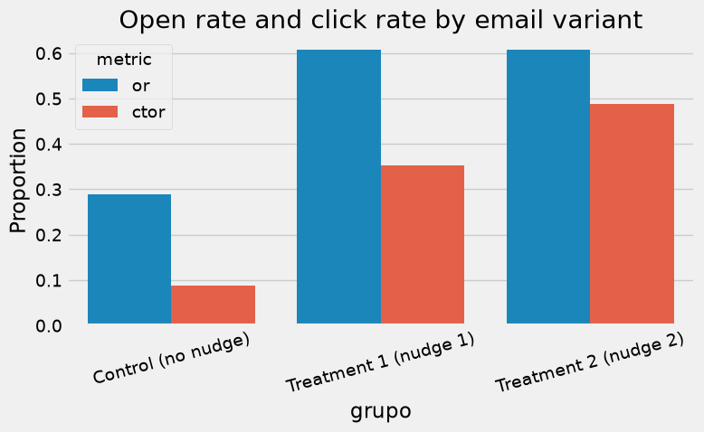

# 04 — Data storytelling for the client

Executive narrative of the email experiment with nudges.


```python
import sys
from pathlib import Path

import matplotlib.pyplot as plt
import pandas as pd
import seaborn as sns

ROOT = Path.cwd().parent if Path.cwd().name == 'notebooks' else Path.cwd()
sys.path.insert(0, str(ROOT))
from src.data import GROUP_LABELS, load_data

df = load_data(ROOT / 'data' / 'datos_prueba_tecnica.csv')
```

## 1. The bank's challenge


```python
summary = df.groupby('grupo', observed=True)[['or', 'ctor']].mean()
summary.index = summary.index.map(GROUP_LABELS)
ctrl_or, ctrl_ctor = summary.loc[GROUP_LABELS['ctrl']]
best = summary.loc[GROUP_LABELS['trat2']]
print(f'Control: {ctrl_or:.1%} open, {ctrl_ctor:.1%} clicks')
print(f'Trat2:   {best["or"]:.1%} open, {best["ctor"]:.1%} clicks')
```

    Control: 28.8% open, 8.7% clicks
    Trat2:   60.8% open, 48.9% clicks


## 2. Experiment result


```python
fig, ax = plt.subplots(figsize=(8, 5))
plot_data = df.groupby('grupo', observed=True)[['or', 'ctor']].mean().reset_index()
plot_data['grupo'] = plot_data['grupo'].map(GROUP_LABELS)
plot_melt = plot_data.melt(id_vars='grupo', var_name='metric', value_name='rate')
sns.barplot(data=plot_melt, x='grupo', y='rate', hue='metric', ax=ax)
ax.set_ylabel('Proportion')
ax.set_title('Open rate and click rate by email variant')
plt.xticks(rotation=15)
plt.tight_layout()
plt.show()
```


    

    


## 3. Estimated impact


```python
n_clients = 500_000
lift_ctor = best['ctor'] - ctrl_ctor
extra_clicks = int(lift_ctor * n_clients)
print(f'If we scale trat2 to {n_clients:,} customers:')
print(f'  ~{extra_clicks:,} additional clicks vs control ({lift_ctor:.1%} absolute lift)')
```

    If we scale trat2 to 500,000 customers:
      ~200,773 additional clicks vs control (40.2% absolute lift)


## 4. Recommendation


```python
recommendation = pd.DataFrame({
    'Action': [
        'Deploy email Treatment 2 as the main variant',
        'Priorizar segmentos con mayor CATE (usuarios app, edad media)',
        'Monitorizar A/B continuo post-lanzamiento',
    ],
    'Expected impact': [
        f'+{lift_ctor:.1%} in click rate vs control',
        'Additional optimization via personalization',
        'Early detection of nudge fatigue',
    ],
})
recommendation
```


<div>
<style scoped>
    .dataframe tbody tr th:only-of-type {
        vertical-align: middle;
    }

    .dataframe tbody tr th {
        vertical-align: top;
    }

    .dataframe thead th {
        text-align: right;
    }
</style>
<table border="1" class="dataframe">
  <thead>
    <tr style="text-align: right;">
      <th></th>
      <th>Action</th>
      <th>Expected impact</th>
    </tr>
  </thead>
  <tbody>
    <tr>
      <th>0</th>
      <td>Deploy email Treatment 2 as the main variant</td>
      <td>+40.2% in click rate vs control</td>
    </tr>
    <tr>
      <th>1</th>
      <td>Priorizar segmentos con mayor CATE (usuarios a...</td>
      <td>Additional optimization via personalization</td>
    </tr>
    <tr>
      <th>2</th>
      <td>Monitorizar A/B continuo post-lanzamiento</td>
      <td>Early detection of nudge fatigue</td>
    </tr>
  </tbody>
</table>
</div>


---

**Export:** see [`docs/04_DATA_STORYTELLING.md`](../docs/04_DATA_STORYTELLING.md)
