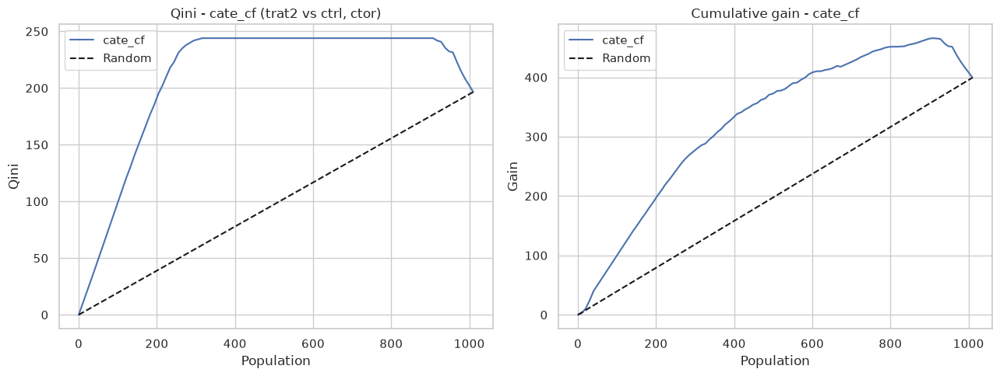
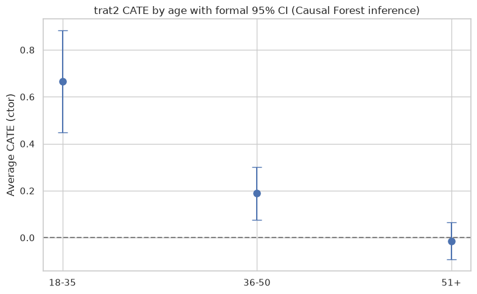

# 05 — Out-of-sample uplift validation & CATE uncertainty

The earlier notebooks estimate *how large* the effect is. Here we answer two rigor questions:

1. **Does the model rank customers by responsiveness well?** We measure it **out-of-sample** (train/test) with **Qini** and **AUUC** curves.
2. **How much uncertainty is there?** We report **confidence intervals** for the CATE from `CausalForestDML`, both per customer and — formally — per segment.


```python
import sys
from pathlib import Path

import matplotlib.pyplot as plt
import numpy as np
import pandas as pd
import seaborn as sns
from causalml.metrics import plot_gain, plot_qini

ROOT = Path.cwd().parent if Path.cwd().name == 'notebooks' else Path.cwd()
sys.path.insert(0, str(ROOT))
from src.data import load_data
from src.uplift import (
    cate_with_confidence,
    evaluate_uplift,
    segment_cate_ci,
    summarize_cate_ci,
)

sns.set_theme(style='whitegrid')
plt.rcParams['figure.figsize'] = (11, 5)
df = load_data(ROOT / 'data' / 'datos_prueba_tecnica.csv')
```

## 1. Out-of-sample validation: does the model rank well?

We split control + treatment into **train/test** (stratified by treatment), fit the T-/X-Learner and Causal Forest on train, and evaluate on the **held-out test set**. A high normalized Qini/AUUC means the model correctly prioritizes the customers who respond most; random targeting scores ~0.


```python
scores2, scored2 = evaluate_uplift(df, 'trat2', 'ctor', learners=('t', 'x', 'cf'),
                                   n_estimators=200, dml_cv=3, test_size=0.3, random_state=42)
scores1, scored1 = evaluate_uplift(df, 'trat1', 'ctor', learners=('t', 'x', 'cf'),
                                   n_estimators=200, dml_cv=3, test_size=0.3, random_state=42)
print('Trat2 vs ctrl (ctor) - out-of-sample uplift:')
display(scores2.round(4))
print('Trat1 vs ctrl (ctor) - out-of-sample uplift:')
display(scores1.round(4))
```

    Trat2 vs ctrl (ctor) - out-of-sample uplift:


<div>
<style scoped>
    .dataframe tbody tr th:only-of-type {
        vertical-align: middle;
    }

    .dataframe tbody tr th {
        vertical-align: top;
    }

    .dataframe thead th {
        text-align: right;
    }
</style>
<table border="1" class="dataframe">
  <thead>
    <tr style="text-align: right;">
      <th></th>
      <th>model</th>
      <th>qini</th>
      <th>auuc</th>
    </tr>
  </thead>
  <tbody>
    <tr>
      <th>0</th>
      <td>cate_cf</td>
      <td>0.5735</td>
      <td>0.8137</td>
    </tr>
    <tr>
      <th>1</th>
      <td>cate_t</td>
      <td>0.5279</td>
      <td>0.8009</td>
    </tr>
    <tr>
      <th>2</th>
      <td>cate_x</td>
      <td>0.5238</td>
      <td>0.7823</td>
    </tr>
  </tbody>
</table>
</div>


    Trat1 vs ctrl (ctor) - out-of-sample uplift:


<div>
<style scoped>
    .dataframe tbody tr th:only-of-type {
        vertical-align: middle;
    }

    .dataframe tbody tr th {
        vertical-align: top;
    }

    .dataframe thead th {
        text-align: right;
    }
</style>
<table border="1" class="dataframe">
  <thead>
    <tr style="text-align: right;">
      <th></th>
      <th>model</th>
      <th>qini</th>
      <th>auuc</th>
    </tr>
  </thead>
  <tbody>
    <tr>
      <th>0</th>
      <td>cate_cf</td>
      <td>0.6529</td>
      <td>0.9024</td>
    </tr>
    <tr>
      <th>1</th>
      <td>cate_t</td>
      <td>0.5243</td>
      <td>0.8406</td>
    </tr>
    <tr>
      <th>2</th>
      <td>cate_x</td>
      <td>0.5214</td>
      <td>0.8374</td>
    </tr>
  </tbody>
</table>
</div>


### Qini and cumulative-gain curves (best model for trat2)

The model curve above the *Random* diagonal means targeting by predicted uplift captures more conversion than targeting at random.


```python
best = scores2.iloc[0]['model']
fig, axes = plt.subplots(1, 2, figsize=(13, 5))
plot_qini(scored2[['y', 'w', best]], outcome_col='y', treatment_col='w', ax=axes[0])
axes[0].set_title(f'Qini - {best} (trat2 vs ctrl, ctor)')
plot_gain(scored2[['y', 'w', best]], outcome_col='y', treatment_col='w', ax=axes[1])
axes[1].set_title(f'Cumulative gain - {best}')
plt.tight_layout()
plt.show()
```


    

    


**Reading:** the Causal Forest typically leads the out-of-sample Qini. Because trat2's effect is large, even targeting the top half by predicted uplift concentrates most of the incremental clicks — evidence that the targeting proposed in notebook 03 genuinely works, not just in the training sample.

## 2. CATE uncertainty (95% CI from the Causal Forest)

A point estimate alone can be over-interpreted. `CausalForestDML` provides a confidence interval per customer; we flag as **significant** those whose interval excludes 0.


```python
ci = cate_with_confidence(df, 'trat2', 'ctor', n_estimators=200, dml_cv=3,
                          alpha=0.05, random_state=42)
display(summarize_cate_ci(ci).to_frame('value').round(4))
```


<div>
<style scoped>
    .dataframe tbody tr th:only-of-type {
        vertical-align: middle;
    }

    .dataframe tbody tr th {
        vertical-align: top;
    }

    .dataframe thead th {
        text-align: right;
    }
</style>
<table border="1" class="dataframe">
  <thead>
    <tr style="text-align: right;">
      <th></th>
      <th>value</th>
    </tr>
  </thead>
  <tbody>
    <tr>
      <th>n</th>
      <td>3364.0000</td>
    </tr>
    <tr>
      <th>mean_cate</th>
      <td>0.1916</td>
    </tr>
    <tr>
      <th>mean_ci_width</th>
      <td>0.1667</td>
    </tr>
    <tr>
      <th>frac_significant</th>
      <td>0.4260</td>
    </tr>
  </tbody>
</table>
</div>


### CATE by age with a formal 95% confidence interval

Instead of averaging the per-customer interval bounds (which ignores the covariance of the estimates), we use the Causal Forest's own inference on each subgroup (`effect_inference(...).population_summary()`), which is the correct CI for a **group average** effect. `significant` = the group interval excludes zero.


```python
seg_age = segment_cate_ci(df, 'trat2', 'edad', outcome='ctor',
                          bins=[17, 35, 50, 100], labels=['18-35', '36-50', '51+'],
                          n_estimators=200, dml_cv=3, alpha=0.05, random_state=42)
display(seg_age.round(4))

fig, ax = plt.subplots(figsize=(8, 5))
x = seg_age['segment'].astype(str)
ax.errorbar(x, seg_age['mean_cate'],
            yerr=[seg_age['mean_cate'] - seg_age['ci_lower'],
                  seg_age['ci_upper'] - seg_age['mean_cate']],
            fmt='o', capsize=6, markersize=8)
ax.axhline(0, color='gray', ls='--')
ax.set_ylabel('Average CATE (ctor)')
ax.set_title('trat2 CATE by age with formal 95% CI (Causal Forest inference)')
plt.tight_layout()
plt.show()
```


<div>
<style scoped>
    .dataframe tbody tr th:only-of-type {
        vertical-align: middle;
    }

    .dataframe tbody tr th {
        vertical-align: top;
    }

    .dataframe thead th {
        text-align: right;
    }
</style>
<table border="1" class="dataframe">
  <thead>
    <tr style="text-align: right;">
      <th></th>
      <th>segment</th>
      <th>n</th>
      <th>mean_cate</th>
      <th>ci_lower</th>
      <th>ci_upper</th>
      <th>significant</th>
    </tr>
  </thead>
  <tbody>
    <tr>
      <th>0</th>
      <td>18-35</td>
      <td>577</td>
      <td>0.6650</td>
      <td>0.4473</td>
      <td>0.8827</td>
      <td>True</td>
    </tr>
    <tr>
      <th>1</th>
      <td>36-50</td>
      <td>1481</td>
      <td>0.1884</td>
      <td>0.0752</td>
      <td>0.3015</td>
      <td>True</td>
    </tr>
    <tr>
      <th>2</th>
      <td>51+</td>
      <td>1306</td>
      <td>-0.0138</td>
      <td>-0.0919</td>
      <td>0.0644</td>
      <td>False</td>
    </tr>
  </tbody>
</table>
</div>


    

    


## Conclusion

- **The targeting is validated out-of-sample:** Qini/AUUC well above random, with the Causal Forest leading.
- **Heterogeneity is real but nuanced:** younger customers (18-35) show a large, statistically significant effect, while for the oldest segment the group CI includes 0 — the effect is not distinguishable from noise. So prioritize the segments with both a high CATE **and** a significant interval.
- Combined with the scaled impact from notebook 04, this supports deploying **trat2** while prioritizing younger / app-user segments.

---

### Next

→ [Project overview (README)](../../README.md)
